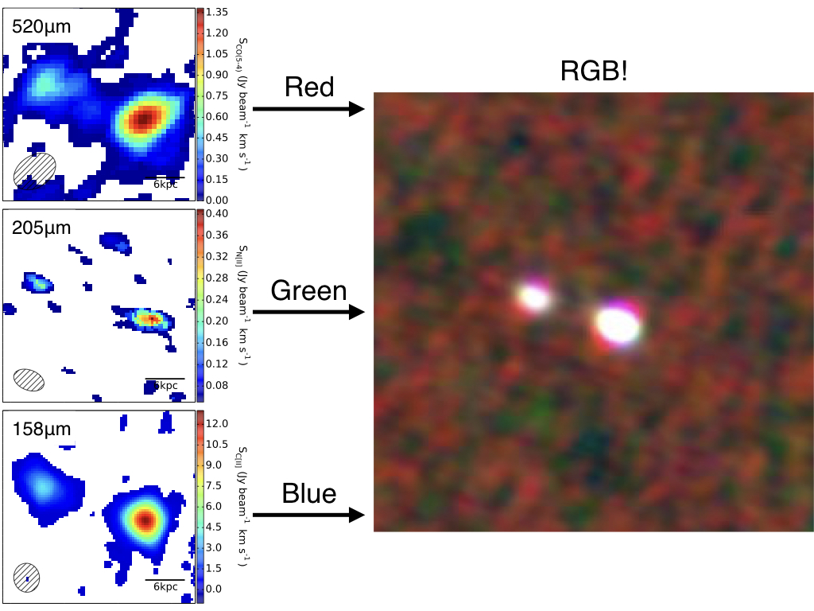

# General-Astronomy-Astrophysics
These scripts are used in a wide variety of astronomy/astrophysics

You may find detailed descriptions for each script with the code.

These scripts provide insight on the following:
- calculating a Bonnor-Ebert sphere for any general molecular cloud;

- identifying a galaxy cluster from the field and providing number and luminosity density functions;

- turning any set of 3 images of a celestial object into an RGB image.

